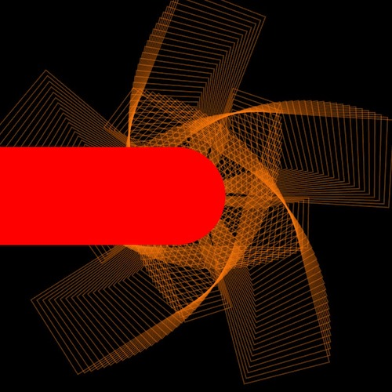

# Common Questions from  CCLab 2024
## Table of Content
1. [Q1:Lifespan](#Q1-Lifespan)
2. [Q2:Partially-BlendMode](#Q2-Partially-BlendMode)
3. [Q3:Pattern-Background](#Q3-Pattern-Background)
4. [Q4:Gradient-Color](#Q4-Gradient-Color)

## Step-by-step Explanation
### Q1-Lifespan
How to create a lifespan for my creature?
[p5-web-editor](https://editor.p5js.org/CarrotLiu/sketches/LJwbblAUp)

```JavaScript

```

### Q2-Partially-BlendMode
How to have the "blendMode" only affect some of the shapes on canvas?
[p5-web-editor](https://editor.p5js.org/CarrotLiu/sketches/LJwbblAUp)
By defalt, the blendMode is "BLEND". Let's draw a normal rectangle and fill it with red
```JavaScript
noStroke();
fill(255, 0, 0); // red color 
rect(50, 50, 100, 100);
```

```JavaScript
push();
fill(255, 0, 0); // still apply red color
blendMode(DIFFERENCE);
beginShape();
vertex(150, height / 2);
vertex(250, height / 2);
vertex(200, 280);
endShape(CLOSE);
pop();
```

### Q3-Pattern-Background
How to keep the landscape patterns as background while drawing animated creatures on top?


[p5-web-editor](https://editor.p5js.org/CarrotLiu/sketches/JJtUjvEjJ)
Let's steal a pattern from [Moon's in-class demo](https://editor.p5js.org/MOQN/sketches/bGi5ZmoKq). First, put it into a for loop and runs it in `setup()`.
```JavaScript
let angle = 0;
let h = 50;
let x = 0;
function setup(){
    for (let i = 0; i < 200; i++) {
        angle += 72+0.2;
        x += -1;
        h += 0.2;
        push();
        translate(width/2, height/2);
        rotate( radians(angle) );
        //blendMode(ADD);
        noFill();
        stroke(255, 120, 10, 100);
        rect(x, 0, 120, h);
        pop();
    }
}
```



Now we have a background with pattern. But if we try to animate a circle in `draw()`, it will leave a trace without a background in `draw()`:
```JavaScript
function draw(){
    noStroke();
    fill(255, 0, 0);
    circle(frameCount, height / 2, 100);
}
```
We cannot draw background in the `draw()` because it will cover the pattern.

$${\color{orange}Solution One: Using Graphic}$$
[createGraphic](https://p5js.org/reference/#/p5/createGraphics) is a special function in p5js. 
```JavaScript

```

$${\color{orange}Solution Two: Using Array}$$
Now, let's apply "Array"! Still, our aim is to have all the rectangles generated before the draw loop and then rendered as an "image" in the draw loop.
When we create rectangles in the for loop, we only have three variables -- $${\color{red} angle, x, h}$$ -- that vary in each loop and set each rectangle different from others. If we want a still pattern, the three variables need to be fixed for each rectangles every frame. To achieve this, we can first store these variables into arrays. 

```JavaScript
let patternX = [];
let patternH = [];
let patternA = [];
function setup() {
  createCanvas(400, 400);
  background(0);
  // here we take Moon's in-class demo as the pattern
  for (let i = 0; i < 200; i++) {
    angle += 72 + 0.2;
    x += -1;
    h += 0.2;
    patternX.push(x);
    patternH.push(h);
    patternA.push(angle);
  }
}
```
After doing this in the `setup()`, we will get three arrays that have equal number of items. 
```JavaScript
patternX = [x0, x1, x2, ..., x199] // length = 200
patternH = [h0, h1, h2, ..., h199] // length = 200
patternA = [a0, a1, a2, ..., a199] // length = 200
```
We can retrieve the variables from the array with the same index `i` (`patternX[i]`, `patternH[i]`, `patternA[i]`) in a for loop. 
```JavaScript
for(let i = 0; i < patternX.length; i ++){
    push();
    translate(width / 2, height / 2);
    rotate(radians(patternA[i]));
    noFill();
    stroke(255, 120, 10, 100);
    rect(patternX[i], 0, 120, patternH[i]);
    pop();
}
```
Now, if we put this for loop in the draw(), the pattern would stay still because the angle, x, and h stay the same every frame as long as the arrays are not updated.

### Q4-Gradient-Color
How to make gradient color transition with a specific color palette?
[p5-web-editor]()
```JavaScript

```


