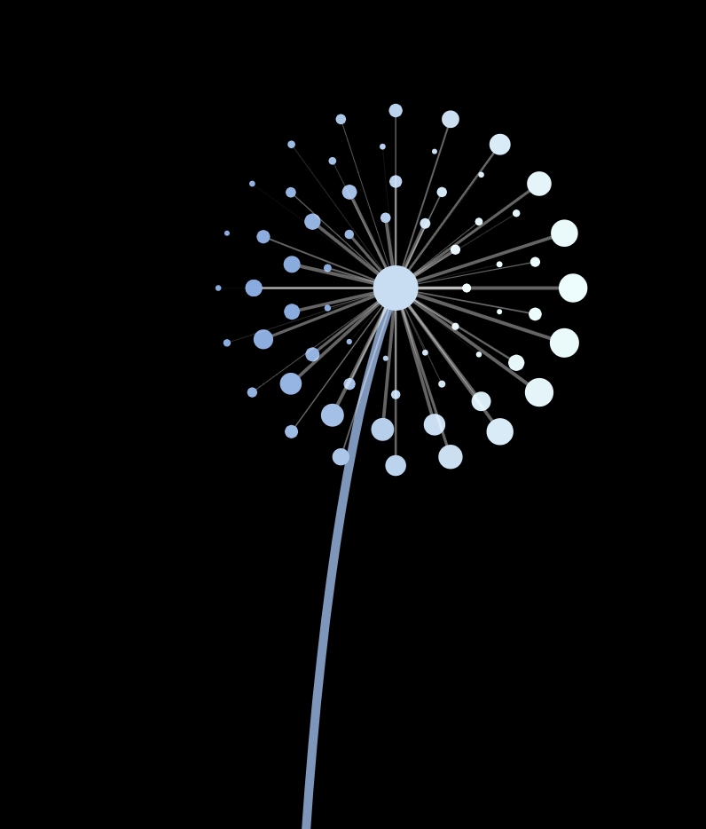

# :white_flower: MagicDande Tutorial :white_flower:

## F23 Creative Coding Lab Midterm



:wave: Welcome and nice to meet you, traveler from Earth! :wave:

I'm Dandie and I'm part of the MagicDande family living on planet B611.

Timid and introvert by nature, I shy away from your touch.

I light up the world with my colorful glow, and I bless the universe with my flying seeds that fly into the endless darkness.

My Little Prince Carrot grew me using p5.js, a little bit of math, some logic, and a lot of playfulness! She's going to walk you through the steps of bringing me to life.

Oh dear traveler from Earth, are you ready to become the Little Prince of your one and only MagicDande on B611?

## Let's Begin!

### Pattern: Play with the For Loops and Create the Pattern!

Remember the grid system you created in class with nested `for()` loop? The inner `for()` loop will increase the index value in the x direction (horizontally), while the outer `for()` loop will increase it in y direction (vertically).
The grid system is a result of the increasing indexes being applied to the x, y position of a p5 shape.

Now, instead of applying the indexes directly to the x, y position, let's apply them to the `sin(freq) * amp` and `cos(freq) * amp`.
Just to recap, the `freq` affect how many samples you will extract from a certain period of the sin wave. The smaller the increment of `freq`, the more samples you get. `amp` refers to the size each sample is scaled to. The range of `sin(freq) * amp` is (-amp, amp).

If we assign the same `freq` and `amp` to the `sin()` and `cos()`, and apply the values respectively to the x, y position of the circle in nested for loop, we will get a layers of circles concentric circular path.


For example, here we will get `r` layers of circles, and each layer has `2*PI / (2 * PI / 12)` circles:

```JavaScript
for (let r = 0; r < 6; r++) {
  for (let i = 0; i < 2 * PI; i += (2 * PI) / 12) {
    fill(255);
    noStroke();
    let x1 = sin(i) * (r * 20);
    let y1 = cos(i) * (r * 20);
    circle(x1, y1, 10);
  }
}
```


Since the first layer start from `r = 0`, the 12 circles overlap with each other. Let's give it an offset value 30 to start with, so that the first layer of circles are 30 away from the center:

```Javascript
let x1 = sin(i) * (30 + r * 20);
let y1 = cos(i) * (30 + r * 20);
```


The `freq` for each layer are the same, making the circles stay in lines. Let's make the `freq` different through using the the `r` index value (the outer for loop index):

```JavaScript
let x1 = sin((PI / 5) * r + i) * (30 + r * 20);
let y1 = cos((PI / 5) * r + i) * (30 + r * 20);
```


This looks nice! We're getting some spiral effect. Notice that there're always 12 samples on each layer because the increment of `i` is a constant. Let's make it vary for each layer by applying `r` value again:

```JavaScript
for (let r = 0; r < 6; r++) {
    for (let i = 0; i < 2 * PI; i += (2 * PI) / (11 + r * 3)) {
      fill(255);
      noStroke();
      let x1 = sin((PI / 2) * (r + 1) + i) * (40 + r * 20);
      let y1 = cos((PI / 2) * (r + 1) + i) * (40 + r * 20);
      circle(x1, y1, 10);
    }
}
```


Aha! Now we get a much more scattered pattern. It looks a bit boring. The circles are of the same size. What about having bigger circles for outer layers?

```JavaScript
circle(x1, y1, 6 + r * 3.5);
```


Hmmmm... Better, but too crowded. Let's makes the size of circles in the same layer vary by using `sin()` and `i`. We need to map it to a range of positive value as circle radius must be positive:

```JavaScript
circle(x1, y1, map(sin(i + PI / 2), -1, 1, 3, 6 + r * 3.5));
```


Cool! Now it's time to make it move!

### Motion: Make the Pattern Move!

### Swaying Effect: Sway in the Breeze of Early Autumn!

### Interaction: Don't Touch Me!

### Function: Become Elegant and Save Some Labor!

### Gradient Color: Shine!

## Live Site Links

- [Midterm Step1 - pattern](https://carrotliu.github.io/Creative-Coding-Tutorial/MagicDande/midterm-step1-pattern/).
- [Midterm Step2 - motion](https://carrotliu.github.io/Creative-Coding-Tutorial/MagicDande/midterm-step2-motion/).
- [Midterm Step3 - swaying effect](https://carrotliu.github.io/Creative-Coding-Tutorial/MagicDande/midterm-step3-swaying-effect/).
- [Midterm Step4 - interaction](https://carrotliu.github.io/Creative-Coding-Tutorial/MagicDande/midterm-step4-interaction/).
- [Midterm Step5 - function](https://carrotliu.github.io/Creative-Coding-Tutorial/MagicDande/midterm-step5-function/).
- [Midterm Step6 - gradient-color](https://carrotliu.github.io/Creative-Coding-Tutorial/MagicDande/midterm-step6-gradient-color/).
- [Midterm Complete Demo](https://carrotliu.github.io/Creative-Coding-Tutorial/MagicDande/midterm-complete/).
