# :white_flower: MagicDande Tutorial :white_flower:

## F23 Creative Coding Lab Midterm


:wave: Welcome abroad, traveler from Earth! :wave:

I'm Dandie and I'm part of [the MagicDande family](https://carrotliu.github.io/Creative-Coding-Tutorial/MagicDande/midterm-complete/) living on planet B611.

Timid and introvert by nature, I shy away from your touch.

I light up the world with my colorful glow, and I bless the universe with my flying seeds that fly into the endless darkness.

My Little Prince grew me using p5.js, a little bit of math, some logic, and a lot of playfulness!

Oh dear traveler from Earth, are you ready to become the Little Prince of your one and only MagicDande on B611? Here's a copy of my Little prince's Planting Journal.

## Planting Journal 2023

### Pattern: Play with the For Loops and Create the Pattern!

What should I make? I have no idea at the beginning, so I decide to experiment with patterns in the `setup()` function.

> [!NOTE]
> In class, professor created a grid system with nested `for()` loop. The inner `for()` loop will increase the index value in the x direction (horizontally), while the outer `for()` loop will increase it in y direction (vertically).
> The grid system is a result of the increasing indexes being applied to the x, y position of a p5 shape.

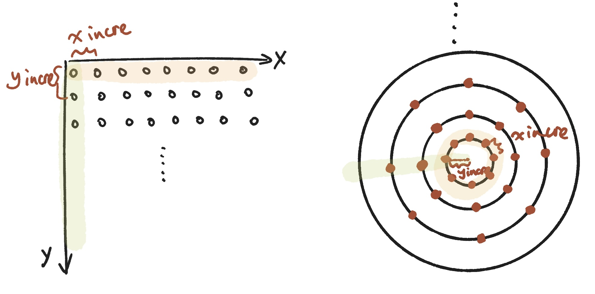
Now, instead of applying the indexes directly to the x, y position, I'll apply them to the sin(freq) * amp and cos(freq) * amp.

Just to recap, the `freq` affect how many samples will be extracted from a certain period of the sin wave. The smaller the increment of `freq`, the more samples one gets. `amp` refers to the size each sample is scaled to.

If I assign the same `freq` and `amp` to the `sin()` and `cos()`, and apply the values to the x, y position of the circle in nested for loop, I will get a pattern of circles arranged in a circular fashion with multiple layers:

```JavaScript
for (let r = 0; r < 6; r++) {
  for (let i = 0; i < 2 * PI; i += (2 * PI) / 12) {
    fill(255);
    noStroke();
    let x1 = sin(i) * (r * 20);
    let y1 = cos(i) * (r * 20);
    circle(x1, y1, 10);
  }
}
```

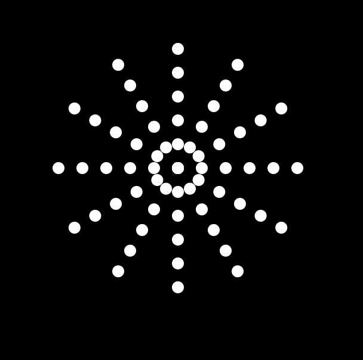

Here, I get `r` layers of circles, and each layer has _2*PI / (2 * PI / 12)_ circles.

The outer for loop iterates through different "layers". The variable `r` represents the current layer, and the loop will run from `r = 0` to `r = 5`, which means it will create 6 layers.

```Javascript
for (let r = 0; r < 6; r++)
```

The inner for loop iterates through angles from 0 to `2 * PI` (a full circle) and divides the circle into 12 equal segments. The variable `i` represents the current angle in radians.

```Javascript
for (let i = 0; i < 2 * PI; i += (2 * PI) / 12)
```

The following code calculates the x and y coordinates for the center of each circle within the layer. It maps the angles `i` to the positions on the circle. Making the amplitude `r * 20` increases the radius of circles layer by layer.

```Javascript
let x1 = sin(i) * (r * 20);
let y1 = cos(i) * (r * 20);
```

Since the first layer starts from `r = 0`, the 12 circles overlap with each other. I'll offset them by 30 from the center:

```Javascript
let x1 = sin(i) * (30 + r * 20);
let y1 = cos(i) * (30 + r * 20);
```

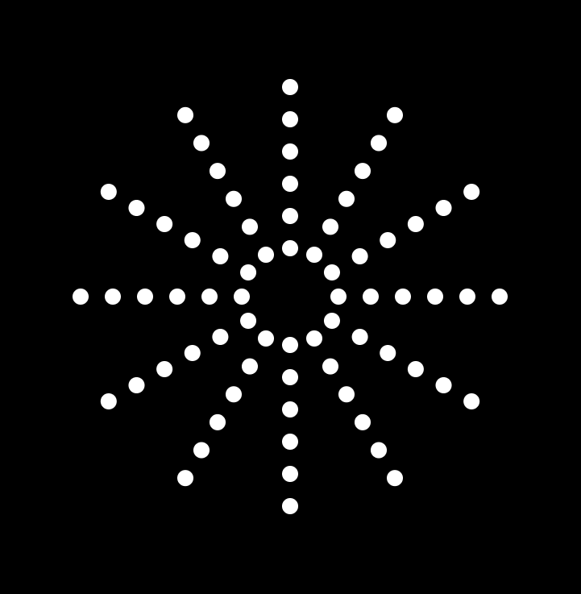

The `freq` for each layer are the same, making the circles stay in lines. Too boring. Let me make the `freq` different through using the the `r` index value (the outer for loop index):

```JavaScript
let x1 = sin((PI / 5) * r + i) * (30 + r * 20);
let y1 = cos((PI / 5) * r + i) * (30 + r * 20);
```

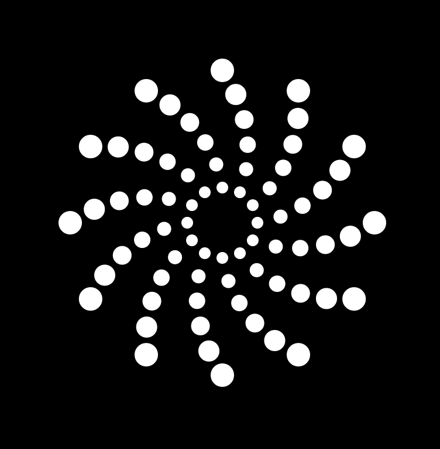
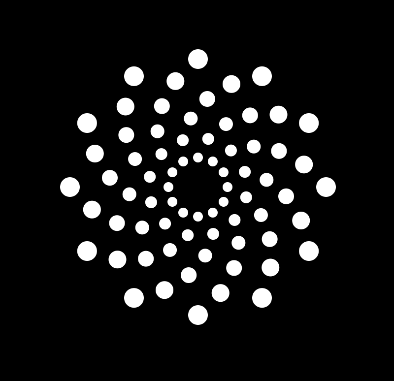

This looks nice! I'm getting some spiral effect. I find that there're always 12 samples on each layer because the `increment of `i`is a constant. Gonna make it vary for each layer by applying`r` value again:

```JavaScript
for (let r = 0; r < 6; r++) {
    for (let i = 0; i < 2 * PI; i += (2 * PI) / (11 + r * 3)) {
      fill(255);
      noStroke();
      let x1 = sin((PI / 2) * (r + 1) + i) * (40 + r * 20);
      let y1 = cos((PI / 2) * (r + 1) + i) * (40 + r * 20);
      circle(x1, y1, 10);
    }
}
```

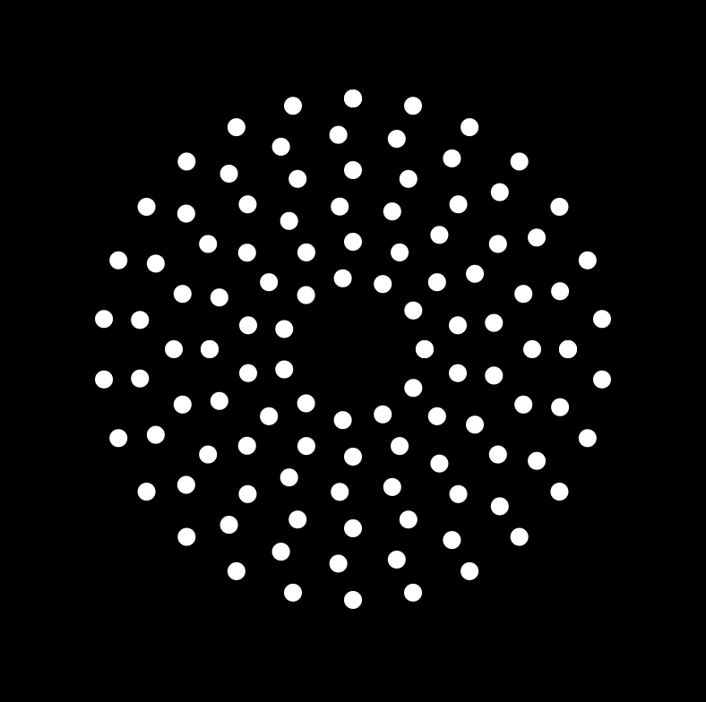

Aha! Now I get a much more scattered pattern. It still looks a bit boring though. The circles are of the same size. What about having bigger circles for outer layers?

```JavaScript
circle(x1, y1, 6 + r * 3.5);
```

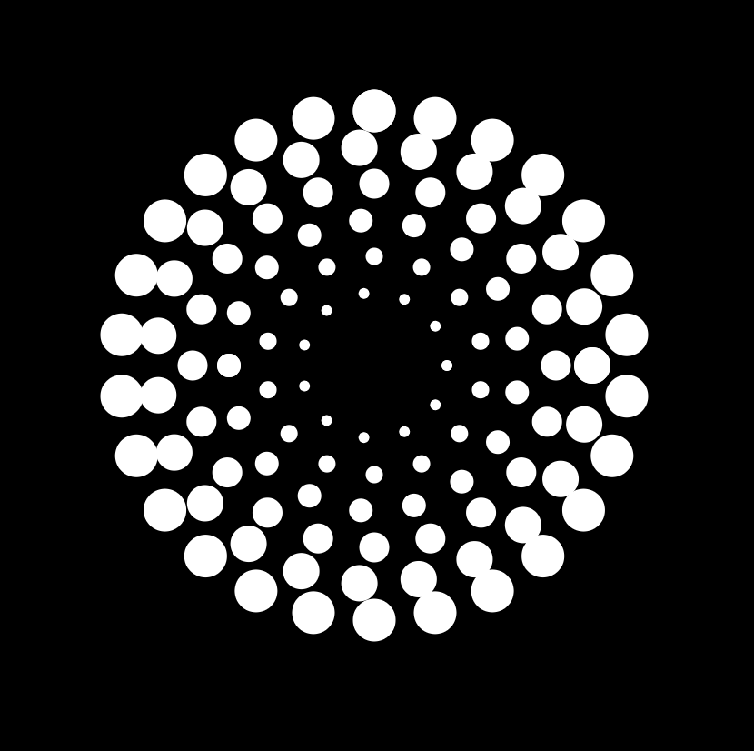

Hmmmm... Better, but too crowded. Let me makes the size of circles in the same layer vary by using `sin()` and `i`. I need to map it to a range of positive value as circle radius must be positive:

```JavaScript
circle(x1, y1, map(sin(i + PI / 2), -1, 1, 3, 6 + r * 3.5));
```

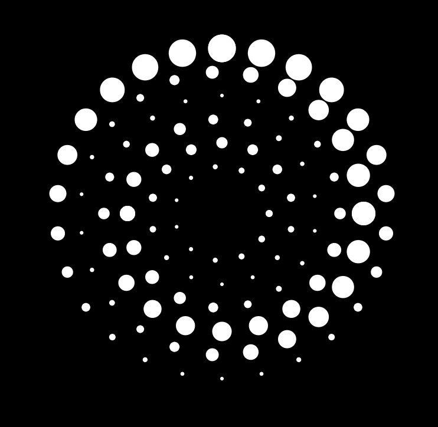

Cool! Now it's a perfect time to make it move!

### Motion: Make the Pattern Move!

The pattern inspires me to create a spiral motion through changing the radius of each circles rather than their position.
I move all the code after the `createCanvas()` into the `draw()` function.
Then, I replace the `r` value in the that change the sine wave frequency with the `frameCount`. This creates a dynamic effect where the radius of the circles in each layer fluctuates over time.

```JavaScript
function draw() {
  background(0);

  translate(width / 2, height / 2);
  for (let r = 0; r < 6; r++) {
    for (let i = 0; i < 2 * PI; i += (2 * PI) / (11 + r * 3)) {
      fill(255);
      noStroke();
      let x1 = sin((PI / 2) * (r + 1) + i) * (40 + r * 20);
      let y1 = cos((PI / 2) * (r + 1) + i) * (40 + r * 20);
      circle(x1, y1, map(sin(i + frameCount * 0.05), -1, 1, 3, 6 + r * 3.5));
    }
  }
}
```

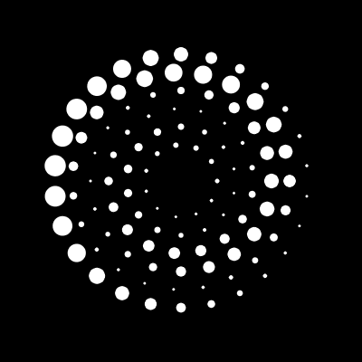

The pattern reminds me of seeds of dandelions swaying in the wind...
Aha! Let there be a Magic Dandelion on B611!
Let there be a core in the middle of the flower!
Let there be stems for the seeds!

```JavaScript
translate(width / 2, height / 2);
for (let r = 0; r < 6; r++) {
    for (let i = 0; i < 2 * PI; i += (2 * PI) / (11 + r * 3)) {
        let x1 = sin((PI / 2) * (r + 1) + i) * (40 + r * 20);
        let y1 = cos((PI / 2) * (r + 1) + i) * (40 + r * 20);
        fill(255);
        stroke(255, 100);
        strokeWeight(1.5);
        line(x1, y1, 0, 0);
        noStroke();
        circle(x1, y1, map(sin(i + frameCount * 0.05), -1, 1, 3, 6 + r * 3.5));
    }
}
circle(0, 0, 30);
```

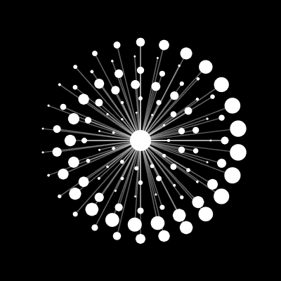

Oooops, the wind is blowing! Seeds are flowing!

```JavaScript
strokeWeight(map(sin(i + frameCount * 0.05), -1, 1, 0.01, 2));
```

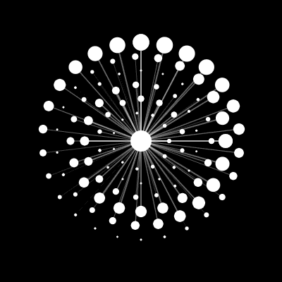
Here I make the strokeWeight fluctuate using the same mapping trick. The seeds' stem are now swaying with the wind.
Cool cool cool.
Wait, I think I miss something...
The stem! The flower itself needs a stem!

### Swaying Effect: Let There Be a Swaying Stem!

Maybe just add a line before the for loop:

```JavaScript
function draw() {
  background(0);

  translate(width / 2, height / 2);
  push();
  fill(255);
  stroke(255, 100);
  strokeWeight(5);
  line(0, 0, 0, 600);
  pop();
  for (let r = 0; r < 6; r++) {
    for (let i = 0; i < 2 * PI; i += (2 * PI) / (11 + r * 3)) {
      let x1 = sin((PI / 2) * (r + 1) + i) * (40 + r * 20);
      let y1 = cos((PI / 2) * (r + 1) + i) * (40 + r * 20);
      fill(255);
      stroke(255, 100);
      strokeWeight(map(sin(i + frameCount * 0.05), -1, 1, 0.01, 2));
      line(x1, y1, 0, 0);
      noStroke();

      circle(x1, y1, map(sin(i + frameCount * 0.05), -1, 1, 3, 6 + r * 3.5));
    }
  }
  circle(0, 0, 30);
}
```

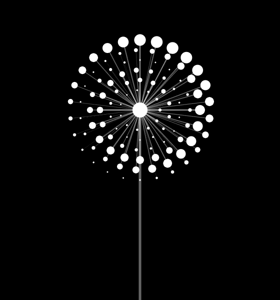

And make it sway:

```JavaScript
let x = map(sin(frameCount * 0.01), -1, 1, -60, 60);
let y = map(cos(frameCount * 0.01), -1, 1, -10, 0);
line(x, y, 0, 600);
```

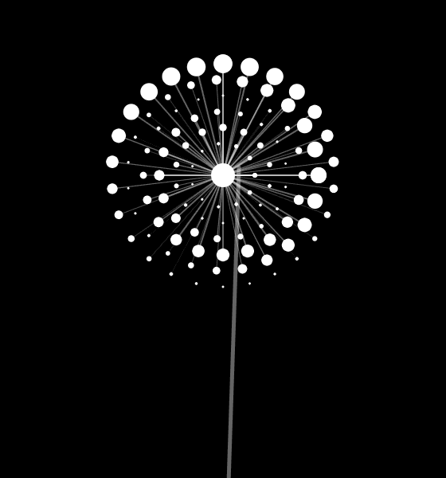
Oooops! Something bad happens! The flower is not following along!
Let me fix it:

```JavaScript
for (let r = 0; r < 6; r++) {
    for (let i = 0; i < 2 * PI; i += (2 * PI) / (11 + r * 3)) {

      fill(255);
      stroke(255, 100);
      strokeWeight(map(sin(i + frameCount * 0.05), -1, 1, 0.01, 2));
      line(x1, y1, x, y);
      noStroke();
      circle(x1, y1, map(sin(i + frameCount * 0.05), -1, 1, 3, 6 + r * 3.5));
    }
  }
  circle(x, y, 30);
```


Here's some break-down:

The first step is to make the seeds follow. So offset all the seeds' position x1 and y1 by x and y:

```JavaScript
let x1 = x + sin((PI / 2) * (r + 1) + i) * (40 + r * 20);
let y1 = y + cos((PI / 2) * (r + 1) + i) * (40 + r * 20);
```

Then, make the seeds' stems follow by making the line's endpoints (x, y):

```JavaScript
line(x1, y1, x, y);
```

Finally, make the core follow by positioning the core circle at (x, y):

```JavaScript
circle(x, y, 30);
```

Bug fixed. But it looks very weird. The stem of the dandelion should be bending while swaying. In this case, I would need a `bezier()` function:

```JavaScript
noFill();
bezier(x, y, 0, 150, 0, 500, 0, 500);
```

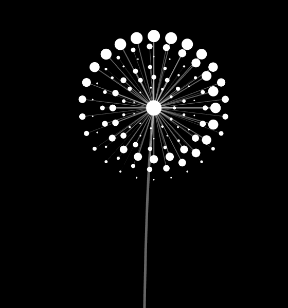

Nice! Now let's add some character to my little magic Dandie~

### Interaction: Don't Touch Me!

Dandie is timid. So it shies away from my touch. The seeds will move away from the hand (or mouse) and reinstate their positions when the hand moves away.

### Function: Become Elegant and Save Some Labor!

### Gradient Color: Shine!

## Live Site Links

- [Midterm Step1 - pattern](https://carrotliu.github.io/Creative-Coding-Tutorial/MagicDande/midterm-step1-pattern/).
- [Midterm Step2 - motion](https://carrotliu.github.io/Creative-Coding-Tutorial/MagicDande/midterm-step2-motion/).
- [Midterm Step3 - swaying effect](https://carrotliu.github.io/Creative-Coding-Tutorial/MagicDande/midterm-step3-swaying-effect/).
- [Midterm Step4 - interaction](https://carrotliu.github.io/Creative-Coding-Tutorial/MagicDande/midterm-step4-interaction/).
- [Midterm Step5 - function](https://carrotliu.github.io/Creative-Coding-Tutorial/MagicDande/midterm-step5-function/).
- [Midterm Step6 - gradient-color](https://carrotliu.github.io/Creative-Coding-Tutorial/MagicDande/midterm-step6-gradient-color/).
- [Midterm Complete Demo](https://carrotliu.github.io/Creative-Coding-Tutorial/MagicDande/midterm-complete/).
